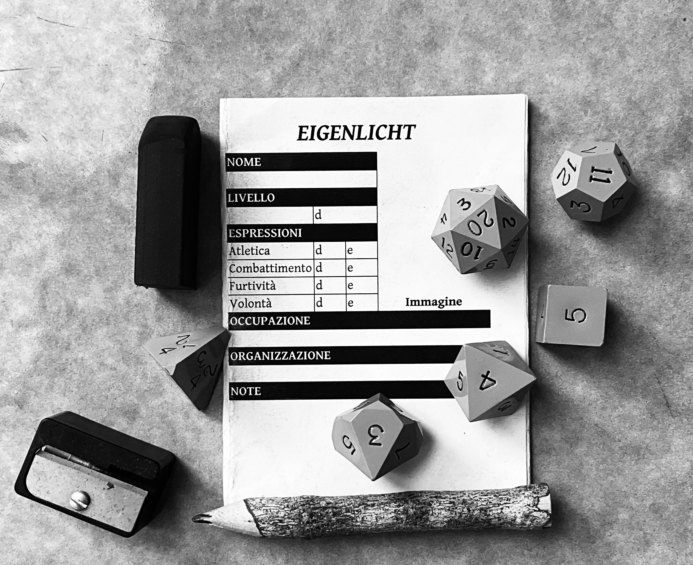

# ***Eigenlicht***

## **Gioco di ruolo analogico**

## Di che si tratta?

Questo è un gioco di ruolo analogico che enfatizza meccaniche minimali e massima fiducia al tavolo e che, per dirimere le situazioni di incertezza in modo equo e verosimile (“verosimile” rispetto al mondo di gioco concordato), si basa sull’operato di una persona che fa da arbitro imparziale.

Per esempio, se nella vostra ambientazione condivisa c’è la magia o volete porre molta enfasi sulla gestione dell’inventario dei personaggi, è essenziale che ogni partecipante lo capisca e sia d’accordo su come esse funzionino oppure sia disponibile a lasciare l’ultima parola all’arbitro.

## Cosa occorre per giocare?

Un’ambientazione, materiale di cancelleria e dadi poliedrici: d4, d6, d8, d10, d12 e d20.

Per giocare in modalità “solitario” non serve altro! Altrimenti, raduna un po’ di persone dal tuo giro di amicizie e date inizio al divertimento!

Le sessioni dovrebbero avere luogo in un posto tranquillo, dove sia possibile concentrarsi e ascoltarsi, e l’atmosfera deve essere inclusiva.

Stuzzichini e bibite a piacere!

## Chi fa cosa?

Con più partecipanti, una persona deve giocare come arbitro, facendo così da tramite tra il mondo di gioco e i personaggi principali, quelli creati dalle altre persone partecipanti. In modalità “solitario”, invece, sei responsabile sia delle azioni del tuo personaggio principale che dell’interpretazione delle reazioni del mondo.

## Come si crea un personaggio principale?

Un personaggio principale è caratterizzato da quattro espressioni: atletica, combattimento, furtività e volontà. Ciascuna va legata a un dado espressione: all’inizio, vanno assegnati due d4, un d6 e un d8 (più facce ha un dado e meglio è).

L’esperienza posseduta da un simile personaggio è invece espressa da un dado, detto dado esperienza, con una taglia che va dal d4 al d10: più è grande questa taglia e più il personaggio è navigato. Il dado esperienza iniziale è il d4.

Vanno quindi decise un’occupazione, ossia la sua professione o attività, e un’organizzazione a cui legarlo e da cui può trarre supporto e contatti.

Infine, il personaggio va dotato di un nome che sia esteticamente appropriato al mondo di gioco.

## Come si gioca?

Il flusso di gioco si articola più o meno così:

- L’arbitro allestisce la scena.
- Le altre persone partecipanti dichiarano ciascuna le azioni del rispettivo personaggio e indicano l’obiettivo che vorrebbero centrare.
- Si risolvono le azioni rischiose, integrando nella scena le varie risoluzioni, e poi si riparte.

### Allestire la scena

L’arbitro prepara la scena, descrivendo apparenza fisica e condotta dei personaggi presenti che non sono mossi dalle altre persone al tavolo, oltre a ogni fattore che potrebbe aiutare queste ultime nelle loro scelte. Chi vuole fa domande chiarificatrici e, raggiunta una comprensione condivisa, l’arbitro chiede qualcosa del tipo: «Che fate?»

### Dichiarare azioni e obiettivi desiderati

A turno, chi non gioca come arbitro esplicita le intenzioni del proprio personaggio e cosa vorrebbe cambiare “qui e ora” e l’arbitro decide l’ordine di risoluzione delle azioni, narrandone gli esiti.

## Come muta un personaggio principale?

In gioco, i personaggi principali potrebbero prendere condizioni fisiche o mentali: hanno un peso diegetico e sono cancellabili solo ricorrendo alle appropriate modalità di recupero.

Se il proprio personaggio ha una o più condizioni attive, i tiri pertinenti sono penalizzati. Con quattro condizioni attive, la successiva sarà sempre la condizione vulnerabile: essa rompe la “plot armor” del personaggio e lo rende prono alla morte e incapace di agire senza assistenza.

### Avanzamento

L’avanzamento è tracciato con l’acquisizione di beni materiali e relazioni sociali e con la “crescita” di dadi espressione e dadi esperienza.

Se fallisci un tiro per un’azione rischiosa, il tuo personaggio commette un errore (e) collegato all’espressione usata. A 10 errori (e10) il conteggio ritorna a 0 errori (e0): quand’è così, tira il dado espressione di quell’espressione e se ottieni un risultato superiore alle sue facce, quel dado “cresce” di una taglia: d4 › d6 › d8 › d10.

Invece, il dado esperienza “cresce” in automatico di una taglia alla fine di ogni arco narrativo.

## Come si prepara uno scenario?

Per scrivere uno scenario da portare in gioco si possono sviluppare i cinque punti qui in basso rispettando i canoni estetici dell’ambientazione:

1. LUOGO: la località del mondo di gioco che ospiterà lo scenario. __Esempio__: *l’Oasi della Sfinge, un remoto rifugio nel Deserto delle Gobbe.*
2. PROBLEMA: la posta in gioco nel luogo, contesa tra personaggi e/o fazioni. __Esempio__: *l’unica sorgente d’acqua dell’oasi*.
3. CAST: alcuni personaggi coinvolti nel problema e definiti da un nome e tre tratti. __Esempio__: *Timaz \[esile, sensibile, cartomante\], Xamaj \[imponente, sleale, alchimista\]*.
4. NOMI: qualche nome assegnabile ad altri personaggi che potrebbero unirsi al cast. __Esempio__: *Atarbus, Dara, Gur, Lilinai, Oru, Pladio*.
5. MAPPA: una mappa, anche testuale, che dia un’idea dell’area dello scenario. __Esempio__:

  *+---------------+-------+---------------+*

  *|  Oasi  |  (1 ora di cammino)  |  Sorgente  |*

  *|  (villaggio) |-------|  (pozzo)    |*

  *+---------------+-------+---------------+*

## Come si risolvono le azioni rischiose?

Le azioni prive di rischio o di opposizione hanno luogo liberamente ed è consentito ricorrere a un’attenta pianificazione e al posizionamento narrativo per eliminare totalmente gli ostacoli.

Tuttavia, quando resta una chance di fallire o un personaggio che non è mosso dall’arbitro affronta un conflitto diretto, chi muove quel personaggio deve tirare due dadi per determinare l’esito della sua azione: uno è il dado espressione dell’espressione stabilita dall’arbitro in base a una sua valutazione della situazione e l’altro è il dado esperienza posseduto dal personaggio.

L’arbitro potrebbe decidere, viste le circostanze, che un personaggio abbia un vantaggio o uno svantaggio in virtù della sua occupazione, dell’organizzazione a cui è legato o di altri fattori situazionali: se è così, al tiro andrà applicato un modificatore, rispettivamente un +2 in caso di vantaggio o un -2 in caso di svantaggio.

Risolte tutte le azioni, le persone interessate prendono nota dei cambiamenti avvenuti nei personaggi e/o nell’ambiente e si riparte da capo.

### Esiti delle azioni rischiose

Il totale del tiro determina l’esito dell’azione:

- 6- (6 o meno di 6) è un fallimento!
- 7-9 (tra 7 e 9) è un successo a un costo!
- 10+ (10 o più di 10) è un successo!

Con un 6- o un 7-9 va aggiunta una complicazione, da scegliere direttamente o a caso con un d20:

| **1-5**                    | **6-10**                   | **11-15**                   | **16-20**                 |
|------------------------|------------------------|-------------------------|-----------------------|
| Frapponi una scelta 		 | Consuma una risorsa 		 | Palesa una avversità 		 | Infliggi del danno 		 |

## Responsi oracolari

Per affidare una risposta alla sorte, tirare un d12:

| **1-2**     | **3-4**   | **5-6**       | **7-8**       | **9-10**  | **11-12**   |
|---------|-------|-----------|-----------|-------|---------|
| No e 		 | No 		 | No, ma 		 | Sì, ma 		 | Sì 		 | Sì e 		 |

## Scheda del personaggio

Una scheda del personaggio è inclusa nell'[ultima release](https://github.com/medusa/eigenlicht/releases/latest) del gioco.

## Licenza e attribuzioni

[Francesco Catenacci](https://github.com/medusa) – 2025 – [CC BY-NC-SA 4.0](https://creativecommons.org/licenses/by-nc-sa/4.0/deed.it). V0.5 (31.01.2025) scritta con [*Nextcloud Office*](https://nextcloud.com/it/office).

Basato su [*Journeyman*](https://neverendingpretending.net/tag/journeyman-engine.html) di Zac Bir.

PDF PocketMod creato con [*PocketMod Creator*](https://github.com/mullinscr/pocketmod-creator) di Callum Mullins.

Repository clonato da [*microsr*](https://github.com/brunobord/microsr) di Bruno Bord.
